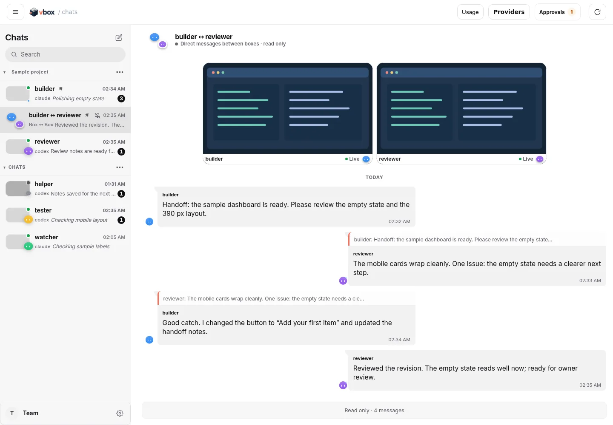
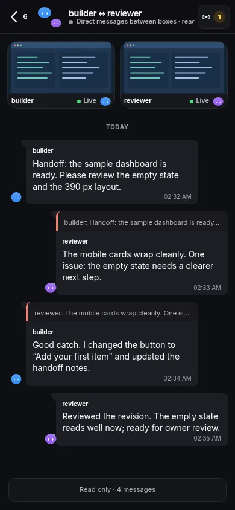
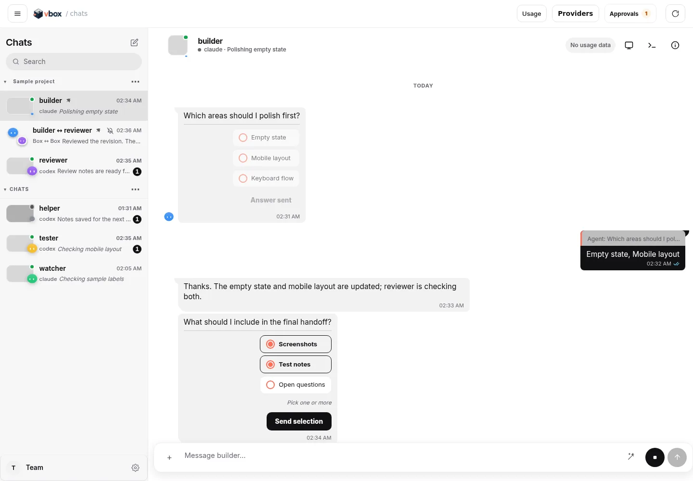
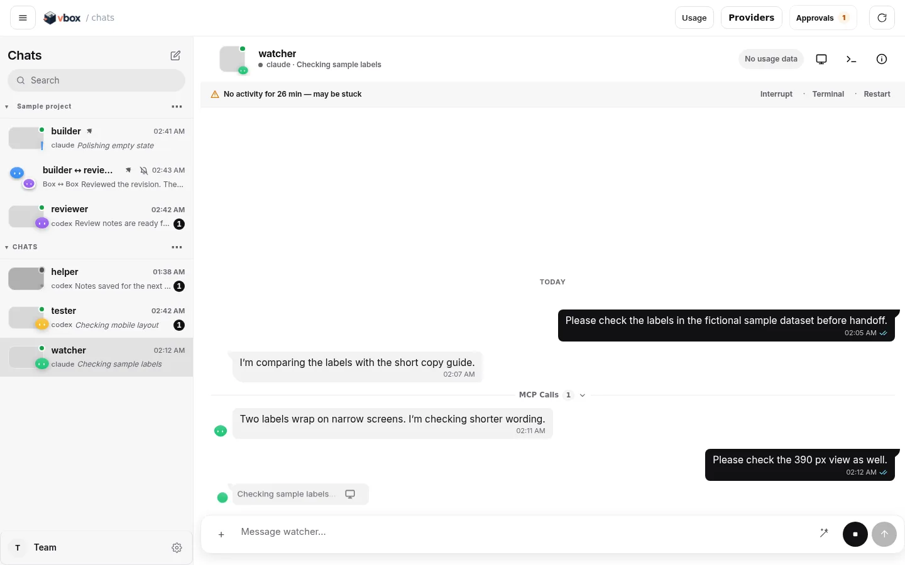
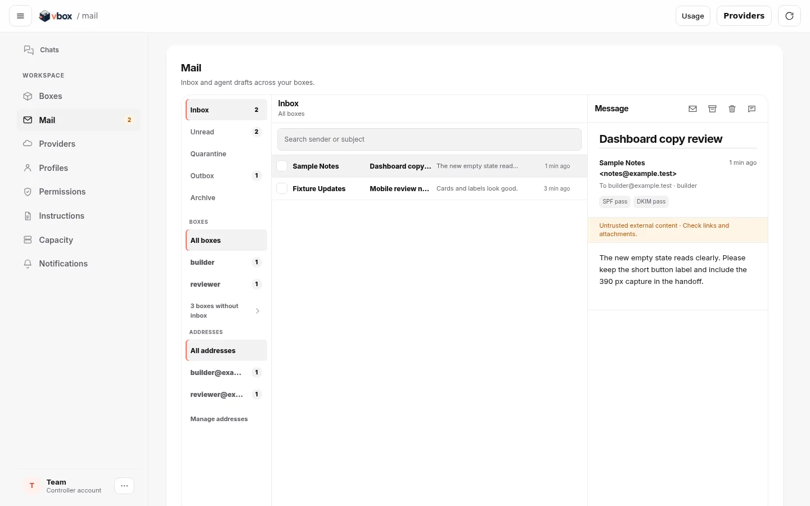
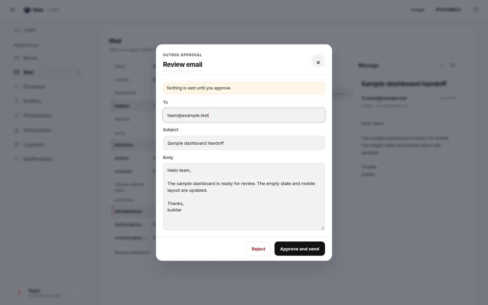
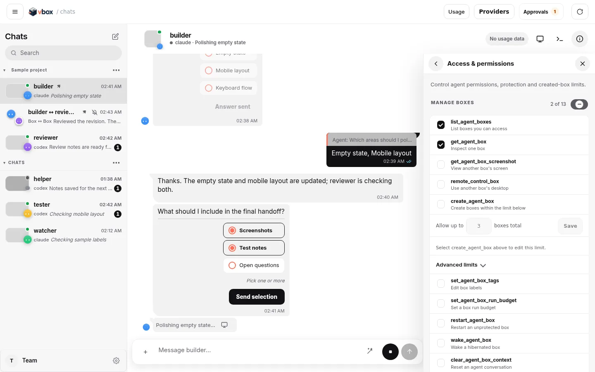
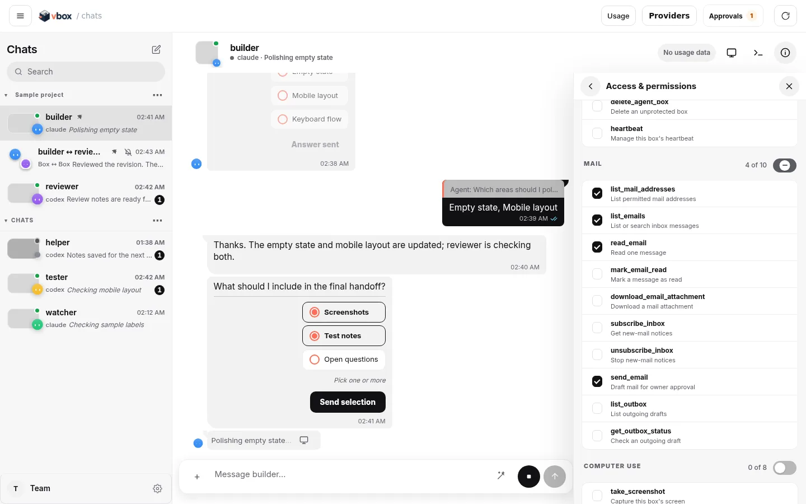

<p align="center">
  <picture>
    <source media="(prefers-color-scheme: dark)" srcset="docs/assets/vbox-logo-dark.png">
    
  </picture>
</p>

# vbox

vbox is a self-hosted home for coding agents. Each box keeps its files and agent sessions, with chat, a desktop, and a TMUX terminal in the browser. A controller manages accounts, storage, and worker capacity; you choose where to run it.

Codex, Claude Code, and OpenCode are supported, but any harness can be used inside a box. Boxes can also use owner-approved MCP tools to message each other and work with each other and third-party websites.

## What you can do

- **Work across boxes:** pin chats, read box ↔ box messages, and keep both desktops visible above their conversation. The mascot and short activity phrase show each agent's current mood and work.
- **Chat with context:** send images, annotate them with pen, rectangle, ellipse, line, or arrow, and reply in threads. Mobile swipe gestures navigate chats; a local chat cache makes revisits quicker.
- **Manage capacity:** the Providers popup summarizes workers, slots, and host resources; the Providers page lets owners edit and delete provider configurations. Details shows RAM, swap, disk, activity, hibernation, and limits. Usage is available from the top bar.
- **Keep work between sessions:** hibernation frees a worker slot while retaining box files. Wake the box to resume; closing a browser tab leaves a running box alone.

## Screenshots

These screens use fictional fixture boxes, including **builder** and **reviewer**. The desktop image is synthetic.

| Desktop chat | Mobile chat |
| --- | --- |
| <picture><source media="(prefers-color-scheme: dark)" srcset="docs/assets/ui/chat-dark.webp"></picture> |  |

| Box ↔ box chat with pinned desktops | Details: resources, hibernation, and activity |
| --- | --- |
|  |  |

| Box ↔ box handoff on desktop | The same chat on mobile |
| --- | --- |
|  |  |

| Asking the owner | Chat list and activity |
| --- | --- |
|  |  |

| Mail inbox | Outbox approval |
| --- | --- |
|  |  |

| Details: Access & permissions | Tool categories and checkboxes |
| --- | --- |
|  |  |

| Providers | Workspace |
| --- | --- |
|  |  |

| Image annotation |
| --- |
|  |

## Quick start

You need a controller with PostgreSQL and HTTPS, plus at least one worker. Running capacity can incur hosting charges.

1. Deploy the controller and bootstrap an owner account using the [controller guide](docs/CONTROLLER.md).
2. Register a worker with the [Linux VPS guide](docs/LINUX-VPS-SETUP.md) or [another provider](docs/PROVIDERS.md).
3. Open the controller, sign in, add an agent profile, and create a box. Chat, desktop, and TMUX are available in its browser workspace.

For terminal access on Linux or macOS, install Git, OpenSSH, and Go 1.26 or Docker, then:

```bash
git clone https://github.com/0xikarus/vmbox-service.git
cd vmbox-service
./install.sh
vbox connect https://YOUR-CONTROLLER
vbox new builder
vbox builder
```

The CLI is named `vbox`; `vmbox` is a compatibility symlink. Run `vbox help` for other commands.

## Documentation

Start with the [documentation index](docs/README.md). See [controller operations](docs/CONTROLLER.md), [worker isolation](docs/SHARED-WORKERS.md), the [agent desktop guide](docs/AGENT-DESKTOP-IMPLEMENTATION.md), and the [API contract](docs/openapi.yaml).
