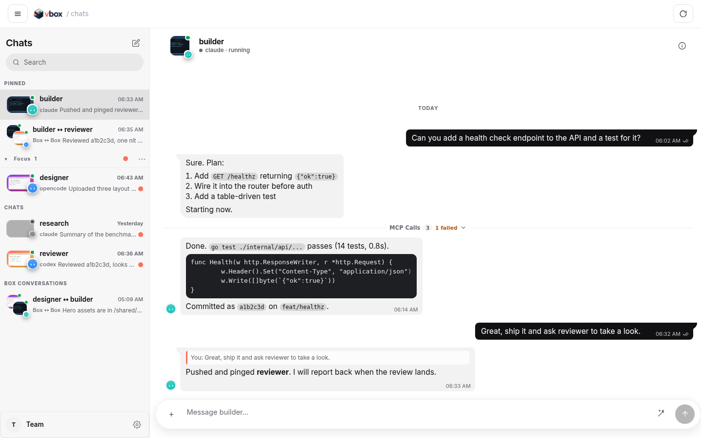
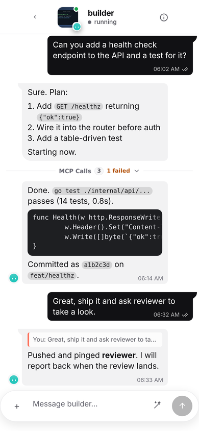
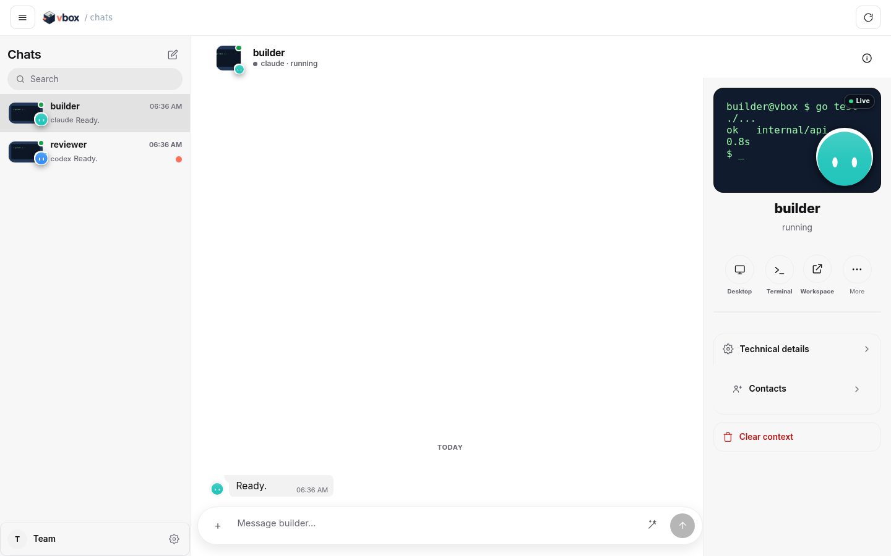
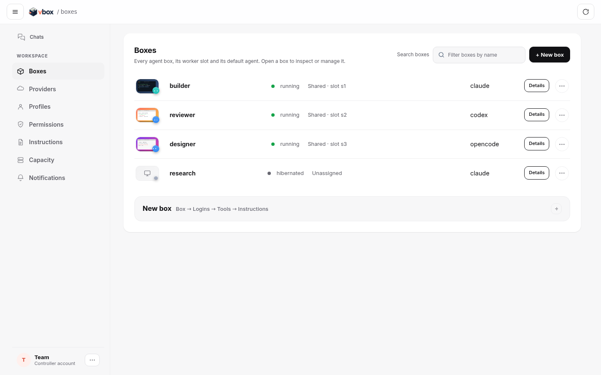
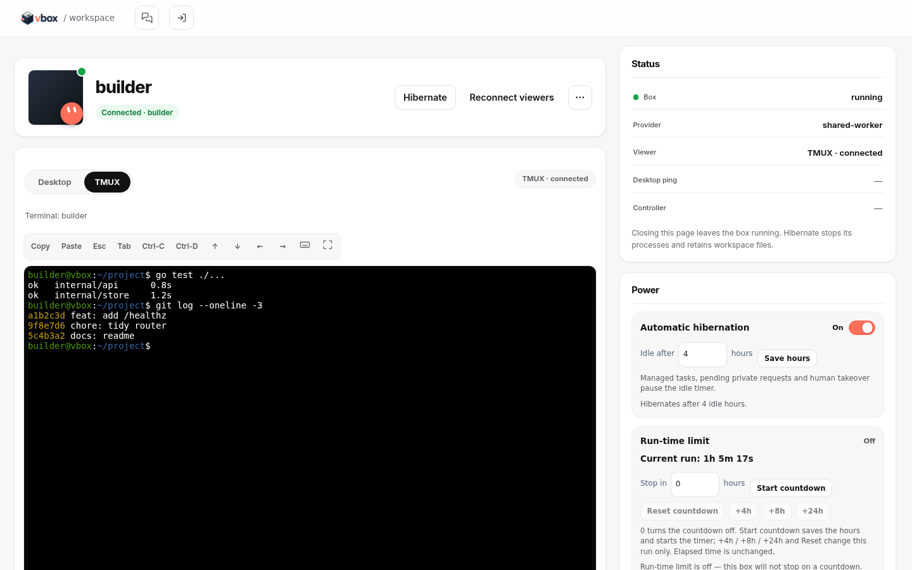
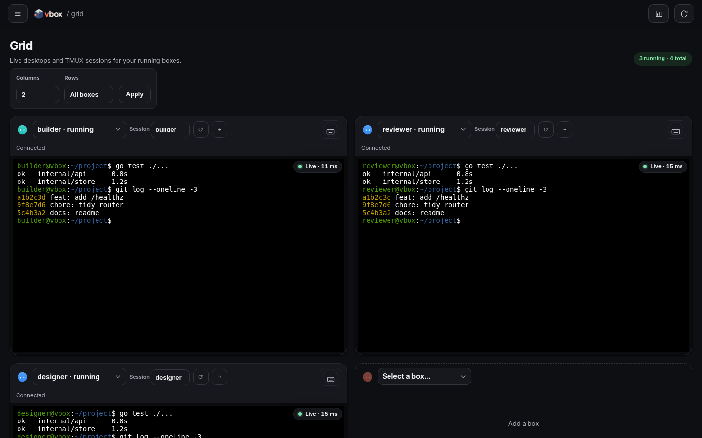
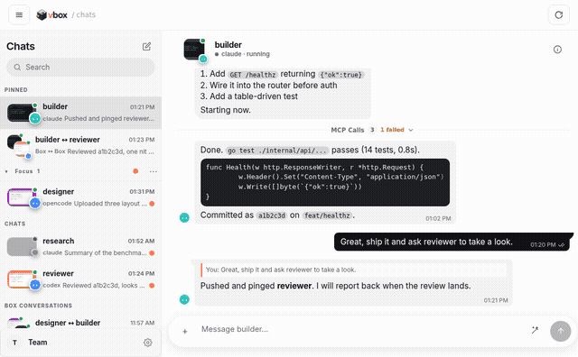

<p align="center">
  <picture>
    <source media="(prefers-color-scheme: dark)" srcset="docs/assets/vbox-logo-dark.png">
    
  </picture>
</p>

# vbox

vbox provides a meta-harness and persistent environments for your agents. Create boxes in the browser and work with their desktop, tmux terminal, and agent chat. The controller manages accounts, workers, and storage; you choose where to host them.

<p><strong>Supported harnesses and subscriptions:</strong>
  <a href="https://openai.com/codex"> Codex (ChatGPT)</a> ·
  <a href="https://claude.com/product/claude-code"> Claude Code (Claude)</a> ·
  <a href="https://opencode.ai"><picture><source media="(prefers-color-scheme: dark)" srcset="docs/assets/harness-opencode-dark.svg"></picture> OpenCode (model API keys)</a>
</p>

Grok Bot inspired this project. I wanted to bring my own agent harness and host the boxes myself, so I built vbox.

## Features

- **Persistent virtual machines:** keep box files and agent sessions across hibernation and restarts.
- **Full desktop access:** use the display, keyboard, mouse, screenshots, terminal, and Grid from your browser.
- **Agent Chat:** talk to each box with images, replies, pinned conversations, and groups.
- **Agent MCP:** let boxes message each other, create or wake boxes, inspect desktops, and use computer tools with owner-controlled permissions.
- **Self-hosting:** run the controller and workers yourself and choose where each box runs.
- **Direct CLI access:** open a box terminal with a command as simple as `vbox mybox`.

## Installation

vbox needs a controller with PostgreSQL and HTTPS, plus at least one worker. Running capacity can incur hosting charges.

1. Deploy the controller and bootstrap an owner account using the [controller guide](docs/CONTROLLER.md).
2. Start a Linux worker and register its capacity. Follow the [self-hosted VPS guide](docs/LINUX-VPS-SETUP.md) or choose [another worker provider](docs/PROVIDERS.md).
3. Open the controller in a browser, sign in, and create a box. Choose its agent, saved login, worker pool, and optional tools.

The browser gives each running box **Desktop**, **TMUX**, and **Chat** views. The [agent desktop guide](docs/AGENT-DESKTOP-IMPLEMENTATION.md) covers tools and browser state; the [local prompt API](docs/LOCAL-AGENT-PROMPT.md) lets apps inside a box send messages.

### Optional CLI

On Linux or macOS, install Git, OpenSSH, and either Go 1.26 or Docker. On Windows, use a Linux environment such as WSL.

```bash
git clone https://github.com/0xikarus/vmbox-service.git
cd vmbox-service
./install.sh
```

The installer places `vbox` in `~/.local/bin` and a `vmbox` compatibility symlink. Open a new terminal if needed, then connect with the token supplied by the controller owner:

```bash
vbox connect https://YOUR-CONTROLLER
vbox profiles upload
vbox new mybox
vbox mybox
```

In **Manage → Profiles → Add profile**, owners can sign in to Codex or Claude Code through a temporary browser terminal, or verify an API key for Codex, Claude Code, OpenRouter, or Venice and select a model. Codex offers ChatGPT device code or a browser link. Device login must be enabled in ChatGPT security or workspace settings. For the browser link, complete sign-in, then copy the full `127.0.0.1:1455/auth/callback` URL from the browser address bar into the dialog; the controller checks the OAuth state and delivers it to the waiting Codex CLI. API keys use provider API billing. The temporary login session is owner-scoped, expires after ten minutes, and saves only the validated credential files in the encrypted profile store. New boxes can select the profile immediately. Apply it to an existing box through **Credentials**; changing the saved profile alone does not update copied box credentials.

`vbox profiles upload` also imports Codex, Claude, OpenCode, or GitHub credentials into encrypted saved profiles. Run `vbox help` for all commands. `vbox desktop mybox` needs a local VNC viewer; the browser desktop does not.

## Browser UI

Chat, manage boxes, and open a desktop or terminal from the browser. These screenshots use demo boxes.

<table>
  <tr>
    <td width="72%"><picture><source media="(prefers-color-scheme: dark)" srcset="docs/assets/ui/chat-dark.png"></picture></td>
    <td width="28%"><picture><source media="(prefers-color-scheme: dark)" srcset="docs/assets/ui/chat-mobile-dark.png"></picture></td>
  </tr>
  <tr><td>Desktop chat keeps conversations, messages, and details in view.</td><td>Mobile chat fits the same controls on a small screen.</td></tr>
</table>



Details opens a live desktop preview when the box desktop is available.

<picture><source media="(prefers-color-scheme: dark)" srcset="docs/assets/ui/manage-dark.png"></picture>

Manage shows box state and the controls to create, start, or hibernate boxes.

<picture><source media="(prefers-color-scheme: dark)" srcset="docs/assets/ui/workspace-dark.png"></picture>

Workspace puts the box desktop and terminal within reach.



Dark mode also covers the Grid view for several boxes at once.



The mascot shows when a box is busy, typing, or ready with a reply. A running agent's box-local MCP process checks its active native conversation every 10 seconds and sends a small sample when it changes. Compact local models on the controller derive mood and activity from the text; the controller stores the derived state and a digest to detect unchanged samples, never the sample itself. See the [mascot classifier guide](docs/MASCOT-CLASSIFIER.md) for training and evaluation.

## How boxes work

A running box uses a worker slot. Hibernation frees the slot and keeps the box's files, but stops its processes. When a saved agent session is available, chat offers to restore it after wake. Closing the browser tab leaves the box running.

## Security and limits

Agents can run commands inside their boxes, and the default image gives the box user passwordless sudo. Keep the controller behind HTTPS, protect its token and encryption key, and choose worker isolation for your host. See [controller operations](docs/CONTROLLER.md) and [shared worker isolation](docs/SHARED-WORKERS.md) before opening an installation to other users.

Saved chat attachments share a 1 GiB account limit. Owners can clear a box's attachments in **Chat → Box details** without deleting message text.

## Development

The [documentation index](docs/README.md) links setup guides and the dated product comparison. The [agent guide](docs/AGENT-GUIDE.md) maps implementation and lifecycle rules; the [API contract](docs/openapi.yaml) documents endpoints.

```bash
go test ./...
go vet ./...
bash tests/run.sh
npm run test:browser
```

Some integration tests require a disposable PostgreSQL database or container. The browser suite requires Chromium; check the scripts before running tests that create resources.
