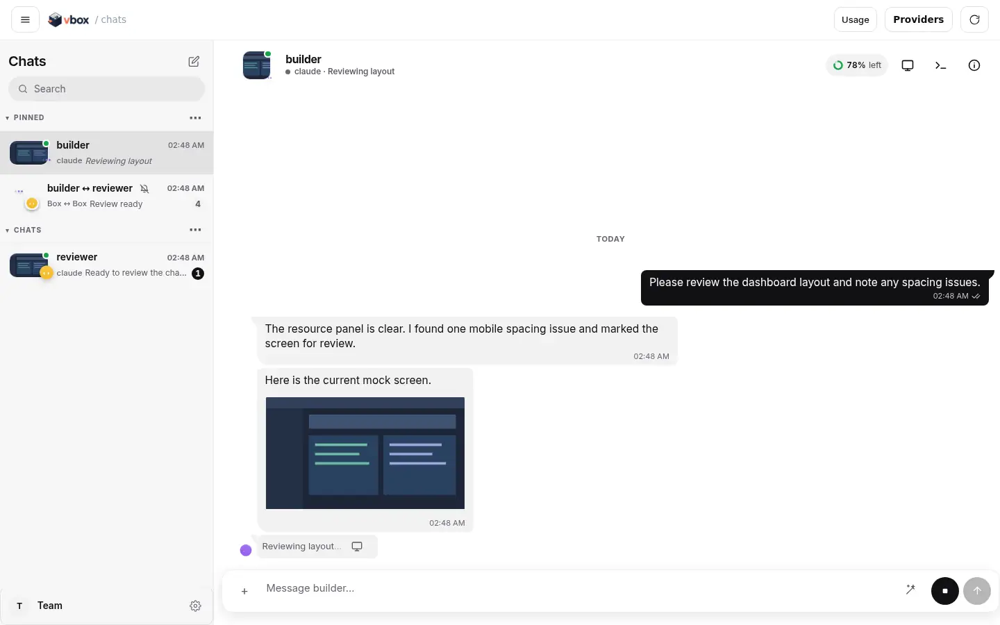
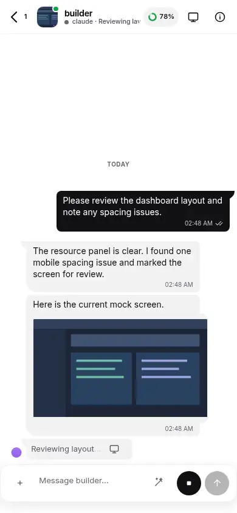
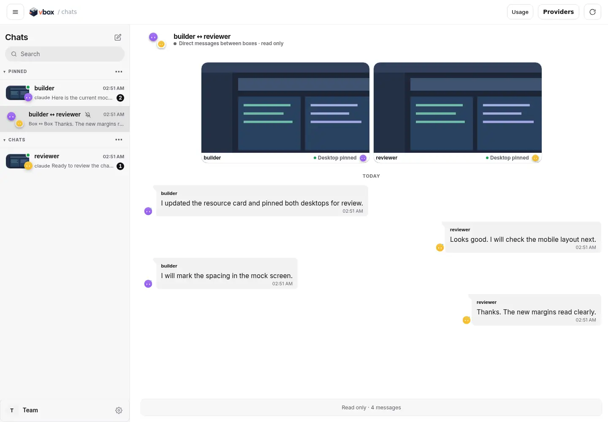
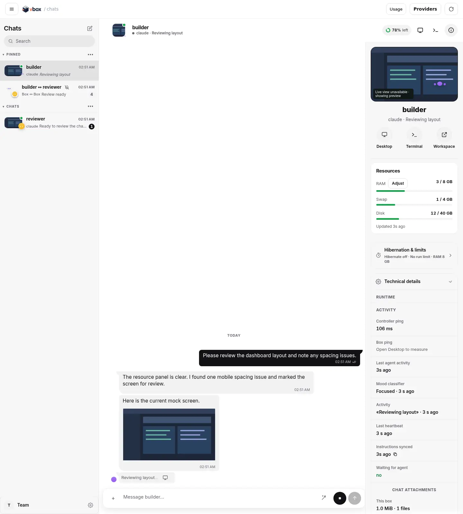
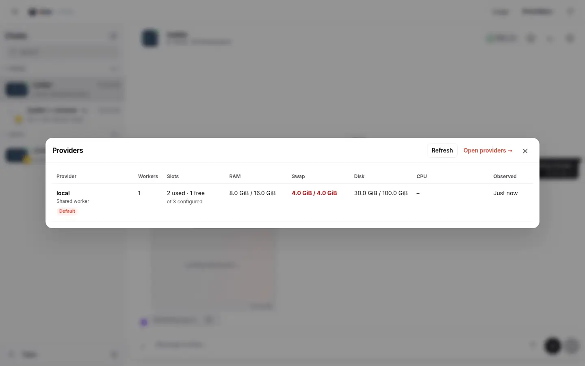
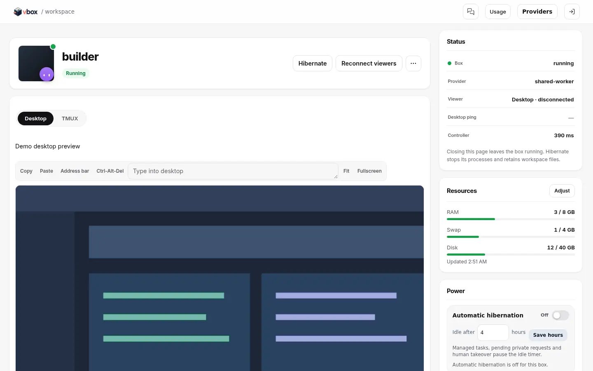
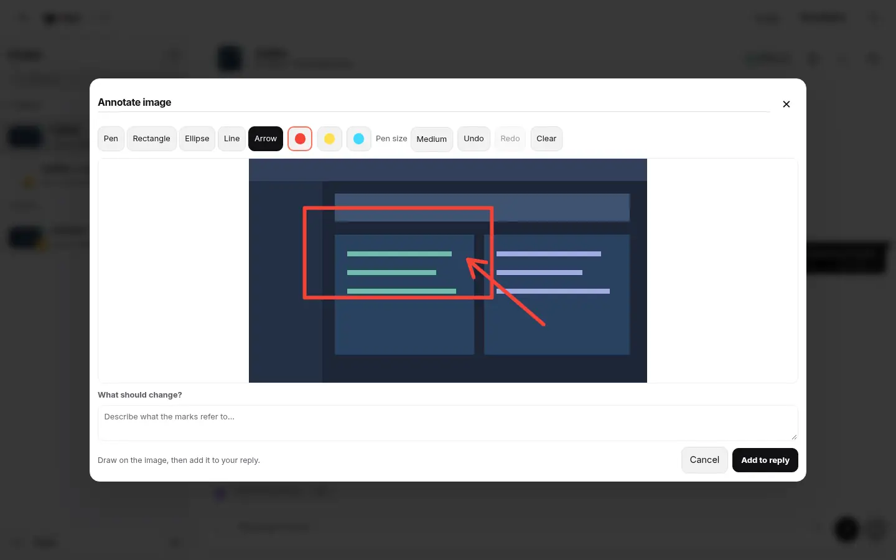
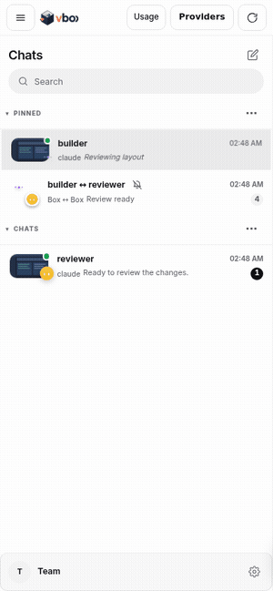

<p align="center">
  <picture>
    <source media="(prefers-color-scheme: dark)" srcset="docs/assets/vbox-logo-dark.png">
    
  </picture>
</p>

# vbox

vbox is a self-hosted home for coding agents. Each box keeps its files and agent sessions, with chat, a desktop, and a TMUX terminal in the browser. A controller manages accounts, storage, and worker capacity; you choose where to run it.

Codex, Claude Code, and OpenCode are supported. Boxes can also use owner-approved MCP tools to message each other and work with desktops.

## Screenshots

These screens use fixture boxes named **builder** and **reviewer**. The desktop image is synthetic.

| Desktop chat | Mobile chat |
| --- | --- |
| <picture><source media="(prefers-color-scheme: dark)" srcset="docs/assets/ui/chat-dark.webp"></picture> |  |

| Box ↔ box chat with pinned desktops | Details: resources, hibernation, and activity |
| --- | --- |
|  |  |

| Providers | Workspace |
| --- | --- |
|  |  |

| Image annotation | Mobile swipe |
| --- | --- |
|  |  |

## What you can do

- **Work across boxes:** pin chats, read box ↔ box messages, and keep both desktops visible above their conversation. The mascot and short activity phrase show each agent's current mood and work.
- **Chat with context:** send images, annotate them with pen, rectangle, ellipse, line, or arrow, and reply in threads. Mobile swipe gestures navigate chats; a local chat cache makes revisits quicker.
- **Manage capacity:** the Providers popup summarizes workers, slots, and host resources; the Providers page lets owners edit and delete provider configurations. Details shows RAM, swap, disk, activity, hibernation, and limits. Usage is available from the top bar.
- **Keep work between sessions:** hibernation frees a worker slot while retaining box files. Wake the box to resume; closing a browser tab leaves a running box alone.

## Quick start

You need a controller with PostgreSQL and HTTPS, plus at least one worker. Running capacity can incur hosting charges.

1. Deploy the controller and bootstrap an owner account using the [controller guide](docs/CONTROLLER.md).
2. Register a worker with the [Linux VPS guide](docs/LINUX-VPS-SETUP.md) or [another provider](docs/PROVIDERS.md).
3. Open the controller, sign in, add an agent profile, and create a box. Chat, desktop, and TMUX are available in its browser workspace.

For terminal access on Linux or macOS, install Git, OpenSSH, and Go 1.26 or Docker, then:

```bash
git clone https://github.com/0xikarus/vmbox-service.git
cd vmbox-service
./install.sh
vbox connect https://YOUR-CONTROLLER
vbox new builder
vbox builder
```

The CLI is named `vbox`; `vmbox` is a compatibility symlink. Run `vbox help` for other commands.

## Architecture

The controller serves the browser UI and API, stores account and box metadata in PostgreSQL, and assigns running boxes to worker slots. Workers host the box environment and persistent files. Hibernation stops processes and releases the slot; the box can be placed again when it wakes. Agent permissions and provider settings are controlled by the owner.

## Documentation

Start with the [documentation index](docs/README.md). See [controller operations](docs/CONTROLLER.md), [worker isolation](docs/SHARED-WORKERS.md), the [agent desktop guide](docs/AGENT-DESKTOP-IMPLEMENTATION.md), and the [API contract](docs/openapi.yaml).

## License

vbox is licensed under the [Apache License 2.0](LICENSE). Bundled third-party components and their licenses are listed in [NOTICE](NOTICE). The vbox name and logo are not covered by the license. To report a vulnerability, see [SECURITY.md](SECURITY.md); to contribute, see [CONTRIBUTING.md](CONTRIBUTING.md).
